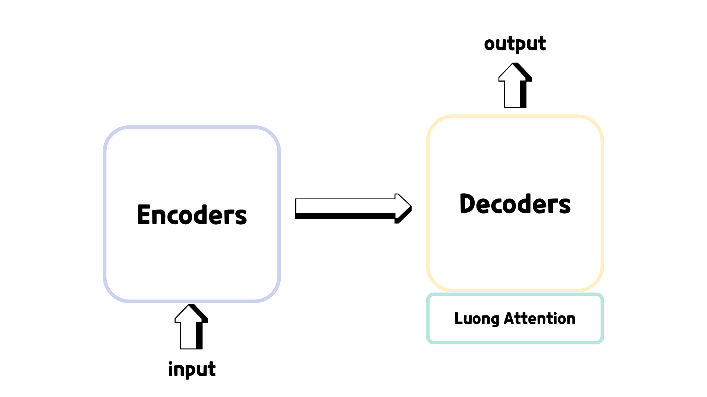

# Model

## Architecture
Seq2Seq with Luong Attention 모델을 사용하였습니다.  
각 Encoder와 Decoder는 bidirectional GRU로 구성되어 있고, 영어를 받아 한국어 발음으로 반환합니다.

## Dataset
사용한 데이터셋은 다음과 같습니다.

- muik의 [transliteration 데이터](https://github.com/muik/transliteration/tree/master/data/source)
  - 수기 입력인 self.txt와 사용자 수정 제안인 suggests.txt는 제외하였습니다.

- eunsour의 [engtokor-transliterator 데이터](https://github.com/eunsour/engtokor-transliterator/tree/main/dataset)

- arstgit의 [high-frequency-vocabulary 30k 영어 데이터](https://github.com/arstgit/high-frequency-vocabulary/blob/master/30k.txt)
  - [아하!사전](http://aha-dic.com/)을 크롤링하여 발음이 전사된 16134개의 데이터 사용하였습니다.

- Kirk Baker의 [English-Korean Transliteration List](https://www.researchgate.net/publication/235633637_English-Korean_Transliteration_List)  

데이터셋은 전처리를 거쳐 학습에 사용되었습니다. 기존 모델들은 국립국어원 외래어 용례 등 특수한 성질을 지닌 데이터를 사용하였기에 일상 용어를 추가하려 했습니다.

## Train
학습 과정에서 상기할만할 특징은 다음과 같습니다.

### Data Augmentation
학습 데이터의 일반화 성능을 높이기 위해, 입력 영어 문자열에 대해 노이즈를 주는 `augment_en_text()` 함수를 사용하였습니다. 증강 방식은 다음 네 가지입니다.

- 모음을 다른 모음으로 치환
- 일부 문자를 삭제
- 인접한 알파벳의 순서를 바꿈
- 동일 문자를 복제하거나 중복 문자를 하나 줄임

변형 결과가 지나칠 경우 원문을 그대로 유지하도록 했습니다.

### Teacher forcing scheduling
학습 안정성을 위해 decoder에서는 teacher forcing을 사용하되, epoch에 따라 점진적으로 낮추는 scheduling을 적용하였습니다.  

전체 epoch을 기준으로  
- 0% ~ 25%: 0.95
- ~ 50%: 0.85
- ~ 75%: 0.80
- ~100%: 0.75
  
### CER(Char Error Rate)
CER은 예측 문자열과 정답 문자열 사이의 Levenshtein distance를 정답 문자열 길이로 나누어 계산합니다. 코드 상에서도 `cer(pred, gold) = levenshtein(pred, gold) / max(1, len(gold))`의 형태로 구현하였습니다. 학습 과정에서 label smoothing이 적용된 cross-entropy를 사용하긴 하지만, learning rate scheduler와 early stopping은 validation set에 대한 CER를 기준으로 동작합니다. CER 계산을 위해선 beam search 기반 decoding이 필요하기에 학습에 시간이 더 소요됩니다.

## Limitation
대부분의 데이터셋에서 영어 띄어쓰기에 따른 한국어 발음 반영이 되지 않았습니다. 가령, `link trainer`은 `링크 트레이너`로 쓰는 것이 옳은 표기이지만 `링크트레이너`와 같이 붙여 쓰는 경우가 혼재했습니다. 또한, 프랑스어, 라틴어 등 다른 나라 언어에 영향을 받은 단어들이 많다보니 한국어 발음 전사에 어려움을 겪었습니다.

## Future work
데이터 전처리 시 대소문자를 전부 소문자로 처리했는데, `WHO(더블유에이치오)`와 `who(후)`처럼 대소문자에 따라 발음이 달라지는 경우를 고려할 수 있습니다.  
또한, T5나 BART같은 multilingual pretrained model을 사용한다면 높은 성능을 기대할 수 있을 것이라 생각합니다.